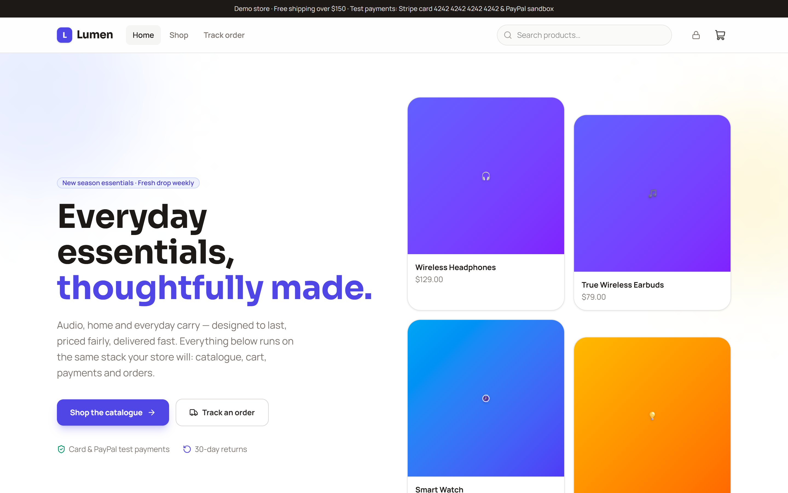
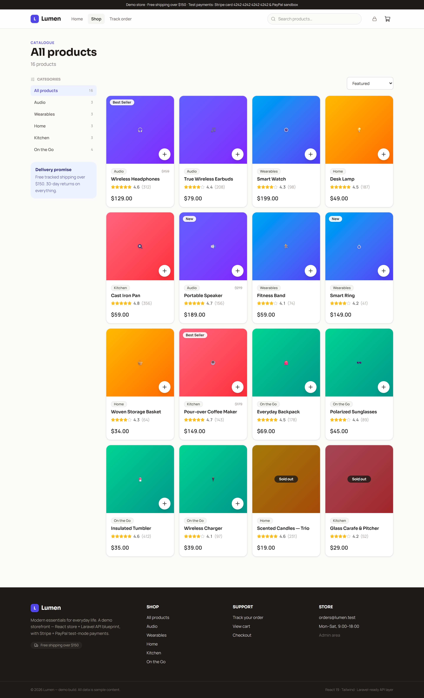
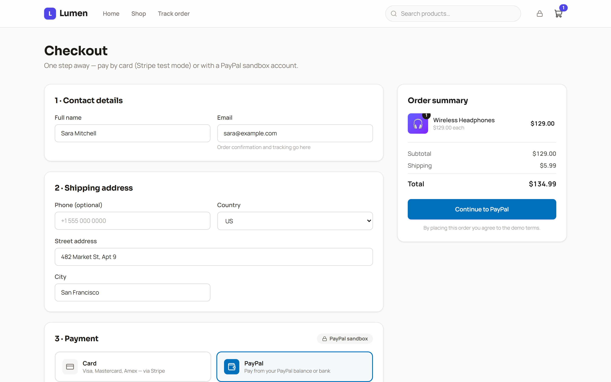
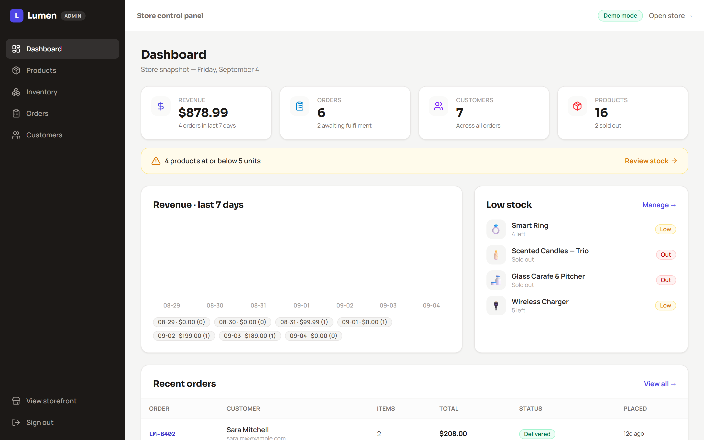
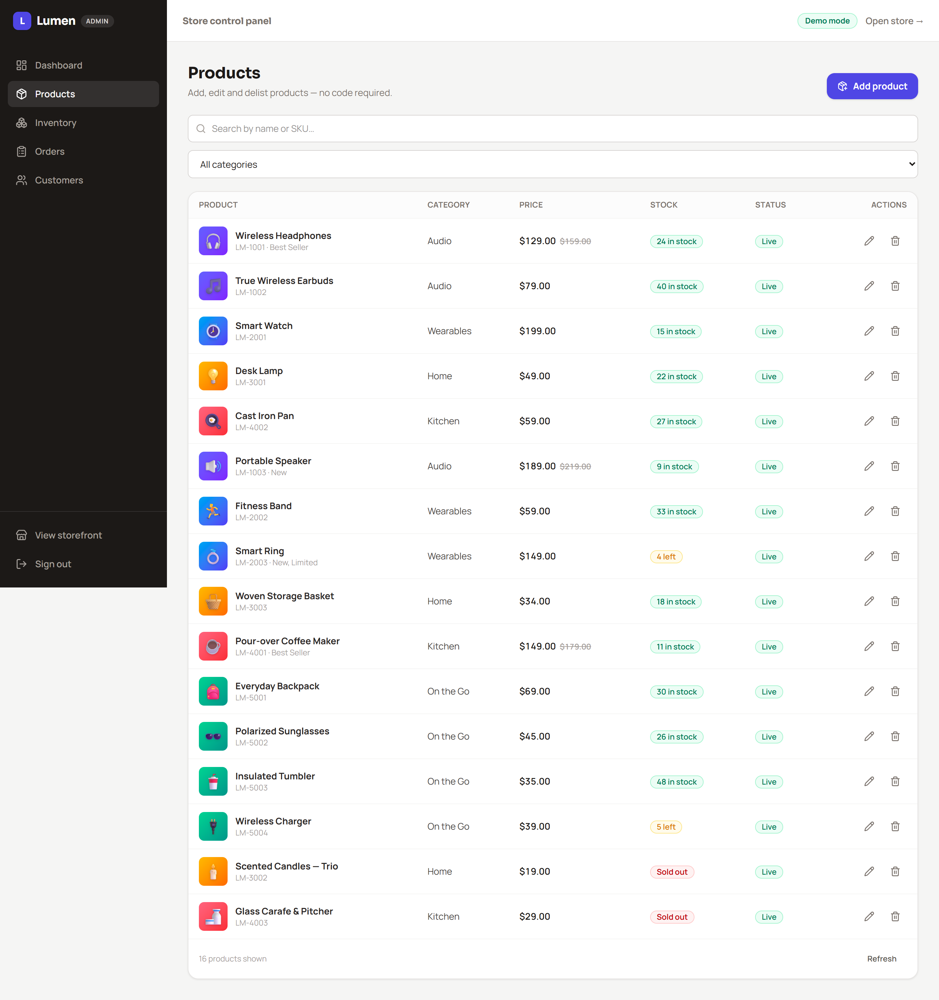

# Lumen — full e-commerce web app (React storefront + Laravel API blueprint)

   

   

A complete, runnable e-commerce application shaped around the three acceptance criteria of a
typical store brief:

1. **Fast on modern browsers** — Vite-served React 19 SPA, Tailwind, route-level code splitting.
2. **Real test purchases work** — the whole purchase loop is implemented end-to-end
   (Stripe card + PayPal sandbox contracts included) and demoable in two minutes with zero backend.
3. **The owner manages products without touching code** — an admin panel with full product
   CRUD, inventory controls, order fulfilment and customer list.

## Screenshots

<p align="center">
  
</p>

| Storefront — catalogue | Checkout — PayPal selected |
|:---:|:---:|
|  |  |
| Admin — dashboard | Admin — no-code product manager |
|  |  |

> Screenshots are captured from the live demo. Regenerate them anytime with
> `cd scripts && npm install && npm run capture` (dev server running, system Chrome).

```
┌────────────┐   ┌───────────────────────────────┐   ┌─────────────┐
│  Customer  │ → │  React storefront  (client/)  │ → │  Laravel    │
│  browser   │   │  /admin = control panel       │ → │  REST API   │ ─→ MySQL
└────────────┘   └───────────────────────────────┘   │  (server/)  │
                                                     └──────┬──────┘
                                              ▼ Stripe Checkout / PayPal approval
```

## Run the demo right now (no backend required)

```bash
cd client
npm install
npm run dev            # → http://localhost:5173
```

The app ships with an in-browser mock backend (`src/lib/mockDb.js`) that emulates the Laravel
API — including server-side price calculation, stock validation/decrement and the Stripe test
card + PayPal sandbox rules — so every screen works against real state persisted in `localStorage`.

### Walk the acceptance criteria in ~2 minutes

| Criterion | Demo path |
|---|---|
| Test purchase | Add a product → cart → checkout → pay by card with `4242 4242 4242 4242` (any future expiry/CVC) **or** via PayPal (`buyer@demo.test`) → order confirmation with tracking timeline. Card `4000…` / a PayPal email containing “decline” show real declined states |
| No-code product management | `/admin/login` (demo: `admin@lumen.test` / `demo`) → Products → add/edit/delete + hide products; Inventory → restock with +/- ; the storefront reflects changes instantly |
| Orders & customers | Place the purchase, then Orders (mark it processing/shipped…) and Customers — the new buyer appears automatically |
| Fast & responsive | Mobile-first layouts, single-pass Vite build; `React.lazy` route-level code splitting means /admin code only downloads when someone opens the panel |

> Reset demo data anytime: clear `localStorage` (or in dev tools run
> `localStorage.removeItem('lumen.db.v1')`).

## Project layout

```
lumen-store/
├─ client/                    React 19 + Vite + Tailwind v4 + React Router + Axios
│  └─ src/
│     ├─ pages/               customer: Home, Shop, Product, Cart, Checkout, Track/Order
│     │   └─ admin/           Dashboard, Products (+form), Inventory, Orders, Customers, Login
│     ├─ components/  layouts/  contexts/   shared UI, chrome, cart & auth state
│     ├─ lib/
│     │  ├─ settings.js       ★ API.USE_MOCK — flip between demo and live Laravel
│     │  ├─ api.js            ★ the only data entry point pages use
│     │  ├─ mockDb.js         in-browser Laravel stand-in (localStorage)
│     │  └─ http.js           axios instance w/ Sanctum bearer token
│     └─ data/                seed products/orders/customers (mirrors DB seeders)
└─ server/                    Laravel blueprint (no PHP runtime needed to demo)
   ├─ database/migrations/    categories, products, product_images, inventory_logs,
   │                          customers, orders, order_items, payments (+role on users)
   ├─ database/seeders/       demo catalogue + admin@lumen.test / demo
   ├─ app/Models  Controllers/Api  Services  Middleware
   ├─ routes/api.php          endpoint table (see server/docs/api.md)
   └─ tests/Feature/          server-side pricing/stock/status tests
├─ docs/screenshots/          README images (captured live)
└─ scripts/                   playwright-core capture script (no browser download)
```

### Why the mock + API split

Every page imports from `lib/api.js` only. That file either calls the mock store or axios,
driven by one switch (`API.USE_MOCK` in `lib/settings.js`). The mock stores prices, computes
totals, validates stock and simulates the Stripe card + PayPal sandbox rules — exactly the rules
Laravel enforces — so flipping to the real API later changes nothing in the UI code.

## Going live: Laravel + MySQL + Stripe/PayPal

Follow `server/README.md` (create a Laravel project → `composer require laravel/sanctum
stripe/stripe-php` → copy `server/` in → `php artisan migrate --seed` → `php artisan serve`),
then flip `API.USE_MOCK = false` in `client/src/lib/settings.js`. The Vite dev proxy already
forwards `/api` to `http://127.0.0.1:8000`. Real hosted payments take over from the simulated
forms automatically — Stripe Checkout (`checkout_url`) or a PayPal approval page (`approval_url`),
chosen by `payment_method` at `/api/checkout`; the client redirects to whichever the server returns.

## Maintainability notes

- **Contracts first**: `lib/api.js` and `server/docs/api.md` define the same endpoints; the mock
  exercises the contract so regressions surface client-side.
- **Money**: `decimal(10,2)` in DB/UI; converted to cents only in `StripeService` (PayPal sends dollars as strings).
- **Security**: Sanctum tokens + `Admin` middleware enforce admin access server-side; guest order
  tracking requires the customer email; webhook signature verification; rate-limited login.
- **Demo polish**: placeholder artwork (emoji tiles) maps to `product_images` uploads later;
  sample reviews are static until a reviews table is added.

## Roadmap ideas

- Image upload to the admin product form (`product_images` table is ready).
- Order emails/receipts (Laravel mail + queue worker), coupons & reviews (tables reserved).
- Deployment: build client into Laravel `public/` or a CDN; `.env` for Stripe/DB; SSL.
